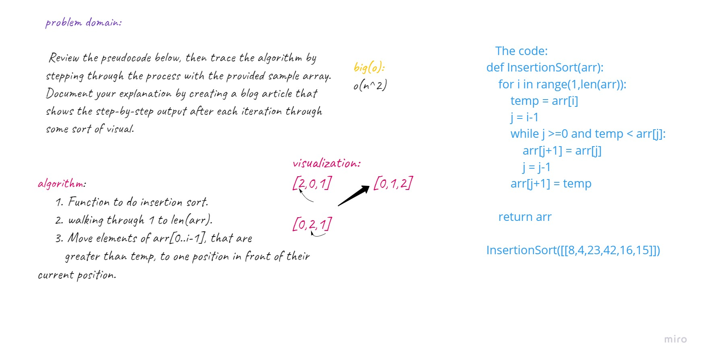

## 1-Reverse an Array
## Challenge
Jut write a function that contains list; we have to arrange the element in reverse way.....

## Approach & Efficiency
I search about it on google and I used the cheatsheet; and it diplayed the method called reverse()

## Solution


## 2-shift 


## 3-First-in, First out Animal Shelter.
## Feature Tasks
* Create a class called AnimalShelter which holds only dogs and cats. The shelter operates using a first-in, first-out approach.
* Implement the following methods:
1- enqueue(animal): adds animal to the shelter. animal can be either a dog or a cat object.
2- dequeue(pref): returns either a dog or a cat. If pref is not "dog" or "cat" then return null.

## 4-Multi-bracket Validation.
* function should take a string as its only argument, and should return a boolean * representing whether or not the brackets in the string are balanced. There are 3 types of brackets:

1. Round Brackets : ()
2. Square Brackets : []
3. Curly Brackets : {}

## 5- Isertion_sort:
### Challenge Summary
* Review the pseudocode below, then trace the algorithm by stepping through the process with the provided sample array. Document your explanation by creating a blog article that shows the step-by-step output after each iteration through some sort of visual.

* tested implementation of Insertion Sort based on the pseudocode provided.
**Pseudocode**
```
  InsertionSort(int[] arr)
  
    FOR i = 1 to arr.length
    
      int j <-- i - 1
      int temp <-- arr[i]
      
      WHILE j >= 0 AND temp < arr[j]
        arr[j + 1] <-- arr[j]
        j <-- j - 1
        
      arr[j + 1] <-- temp
```
### Challenge Description
* Provide a visual step through for each of the sample arrays based on the provided pseudo code
* Convert the pseudo-code into working code in your language
Present a complete set of working tests

### Approach & Efficiency
* Time: O(n^2)
The basic operation of this algorithm is comparison. This will happen n * (n-1) number of times…concluding the algorithm to be n squared.
* Space: O(1)
No additional space is being created. This array is being sorted in place…keeping the space at constant O(1).>

## Solution

